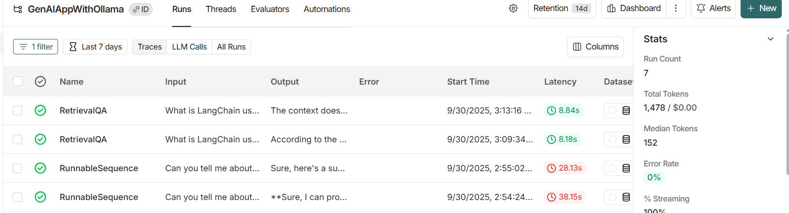

## 📌 Features

- 🧠 **Basic RAG Pipeline Workflow (Jupyter Notebook)**
  - Create vector embeddings with **Ollama embeddings**
  - Store vectors in **FAISS** for fast similarity search
  - Build a retrieval chain using LangChain
  - Ask questions and get context-aware answers

- 💬 **Streamlit Chat App (app.py)**
  - Simple UI for asking questions
  - Powered by **Ollama’s Gemma 2B model**
  - Live answer generation using LangChain chains

- 🔎 **LangSmith Tracking**
  - Trace prompts, chains, and LLM calls
  - Debug and monitor your workflow visually

  

  